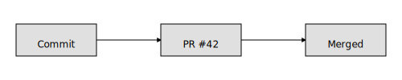

# CM2Git

CM2Git displays recent pull requests, commits, and merge events for any GitHub repository. The page lives under `public/cm2git` so it can be served alongside the rest of the site.

## GitHub token

The page calls the GitHub REST API and requires a personal access token. A classic token with the `public_repo` scope is sufficient for public repositories; use the `repo` scope for private repositories. You can create a token from your [GitHub developer settings](https://github.com/settings/tokens). The token is read only, stored in your browser's `localStorage`, and only sent to GitHub.

## Running locally

1. Clone this repository.
2. Serve the `public` directory with any static server:
   ```bash
   npx serve public
   # or
   python -m http.server --directory public
   ```
3. Navigate to `http://localhost:3000/cm2git/` (adjust the port to match the server).
4. Fill in the GitHub owner, repository name, and your personal access token, then click **Load Activity**.

The interface lets you filter by activity type and sort by date.

## Deployment

This site is hosted with Firebase Hosting, and `firebase.json` already points Hosting at the `public` directory. To deploy the CM2Git page under the existing site:

```bash
firebase deploy --only hosting
```

Once deployed, the page will be available at `/cm2git/` under the site's domain, matching the local structure.

## Accent color

The stylesheet `cm2git.css` defines `--color-accent` to control the highlight color used for interactive elements such as buttons and headings. Adjust the value under `:root` for the default light theme and override it inside `[data-theme='dark']` for dark mode:

```css
:root {
  --color-accent: #0066ff; /* light theme */
}

[data-theme='dark'] {
  --color-accent: #7c4dff; /* dark theme */
}
```

Example of the accent color applied to a button:

```css
#app > button {
  background: var(--color-accent);
}
```

## Commit–Pull–Merge linkage

CM2Git links commits to their pull requests and groups them together, with merge events shown beneath each PR. Each commit is augmented with the associated pull request using the [`commits/{sha}/pulls`](https://docs.github.com/rest/commits/commits?apiVersion=2022-11-28#list-pull-requests-associated-with-a-commit) endpoint. This endpoint is currently in preview and requires the `Accept: application/vnd.github.groot-preview+json` header in addition to `Authorization`.

Merge events are retrieved from the repository Events API and displayed under the corresponding pull request. The result is a timeline where a PR's commits and final merge appear together:



